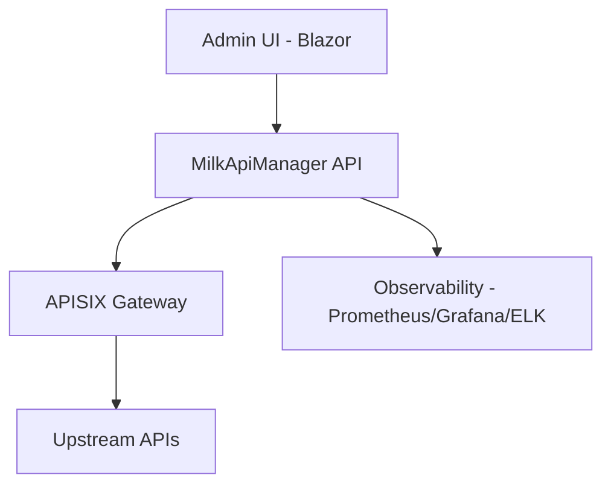

# Milk API Manager System

本專案旨在基於 **Apache APISIX** 建構一套企業級的 API 管理系統（API Management System, APIM）。

## 🚀 專案願景
將高效能的數據面（APISIX）與自定義的管理控制面（Management Plane）結合，提供 API 註冊、安全性控管、流量分析及開發者門戶功能。

## 🛠️ 核心架構規劃
1. **底層引擎 (Data Plane)**: Apache APISIX (高效能路由、插件執行)。
2. **管理中心 (Control Plane)**: 
   - 自研管理後台（支援 AI 輔助配置）。
   - 整合 **Keycloak** 進行帳號與權限管理 (RBAC)。
3. **安全防護**: 
   - 內建 PII 脫敏插件。
   - WAF (Web Application Firewall) 整合。
4. **可觀測性**: 整合 Prometheus + Grafana 以及 ELK Stack。

## Flow (Simple)

詳細版請參考 [docs/architecture_flow.md](docs/architecture_flow.md)。

## 📅 開發藍圖 (Roadmap)
- [x] **Phase 1**: 基礎設施搭建 (APISIX + Dashboard 容器化佈署)。
- [x] **Phase 2**: API 註冊與自動化路由配置功能。
- [ ] **Phase 3**: 整合 Keycloak OIDC 認證流。
- [ ] **Phase 4**: 實作自定義管理功能 (API 金鑰管理、配額控管)。

## 🤝 協作說明
本專案由 **Milk (主代理人)** 與 **龍蝦助手 (外部協作)** 共同開發。
詳細進度請參考 [Issues](https://github.com/tedtv1007-ctrl/milk-api-manager-system/issues)。