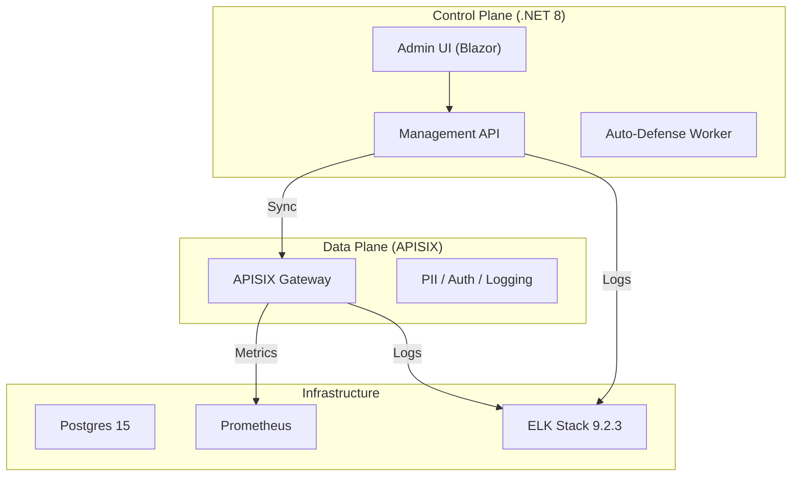

# 🥛 Milk API Manager System
> **企業級全生命週期 API 管理與安全治理平台**

[](https://github.com/tedtv1007-ctrl/milk-api-manager-system/actions)


Milk API Manager 是一套基於 **Apache APISIX** 打造的現代化 API 管理平台，專為企業內部（Intranet）設計，提供從設計、測試、防禦到分析的一站式解決方案。

---

## ✨ 核心亮點 (Core Features)

### 🛡️ 主動式安全治理 (Security & Privacy)
*   **動態 PII 脫敏**：透過自研插件，利用 Regex 即時遮蔽 Response 中的 Email、手機、個資等敏感資訊。
*   **AI 自動化防禦**：聯動 Prometheus 監控，自動識別並封鎖高頻攻擊與惡意掃描 IP (Auto-Blocking)。
*   **通知中心**：整合多頻道 Webhook (Slack/Mattermost)，重大安全事件即時推播。

### 🛠️ 開發者自助門戶 (Developer Experience)
*   **自服務申請**：內部團隊可自主申請 API 訪問權限，管理員一鍵審核，系統自動撥備 APISIX Consumer。
*   **API 測試沙盒**：文件中心嵌入「Live Test」功能，一鍵驗證 API 健康度與延遲。
*   **Mock Lab**：無需後端代碼，直接在網關定義模擬回應，加速前端開發。

### 📊 深度可觀測性 (Observability)
*   **智慧監控看板**：即時 P95 延遲趨勢圖與 Top 5 性能瓶頸分析。
*   **ELK 9.2.3 全量分析**：結構化收集網關訪問日誌與後端審計日誌，具備長效分析與合規報表能力。
*   **壓測集成**：內建 k6 引擎，支援在介面直接發起壓力測試。

---

## 🏗️ 系統架構 (Architecture)



---

## 🚀 快速啟動 (Quick Start)

### 1. 啟動基礎設施 (Docker)
```bash
docker-compose up -d
```

### 2. 執行全系統自動驗證
本專案內建「全綠」驗證腳本，確保所有組件（.NET, Python, Playwright, Docker）運行正常。
*   **Windows**: `./scripts/verify-all.ps1`
*   **Linux/Zeabur**: `./scripts/verify-all.sh`

### 3. 存取入口
*   **管理後台 (Blazor)**: `http://localhost:5000`
*   **API 網關**: `http://localhost:9080`
*   **Kibana 看板**: `http://localhost:5601`

---

## 📖 使用與操作
詳細的操作流程與功能說明，請參考：
👉 **[Milk API Manager 操作手冊](docs/manual/USER_GUIDE.md)**

---

## 📅 開發藍圖 (Roadmap)
- [x] **Phase 1**: 基礎設施與容器化 (Docker + APISIX)。
- [x] **Phase 2**: 後端管理 API 與路由自動同步。
- [x] **Phase 3**: 動態 PII 防護與 AI 自動防禦。
- [x] **Phase 4**: 開發者自助門戶與 Mock Server。
- [x] **Phase 5**: ELK 9.2.3 深度日誌分析。
- [ ] **Phase 6**: API SDK 自動生成器 (C# / Python)。
- [ ] **Phase 7**: 企業 SSO (LDAP/AD) 深度權限對齊。

---

## 🤝 協作規範
本專案採用 **「分散式多節點開發模式」**：
1.  **心跳同步**：啟動前必先讀取 `HEARTBEAT.md`。
2.  **人機鎖定**：開發時請在 `HEARTBEAT.md` 設置 `USER_ACTIVE` 或 `VPS_ID`。
3.  **雲端驗證**：所有 Push 必須通過 GitHub Actions 的整合測試。

---
*Created with ❤️ by OpenClaw for Enterprise API Excellence.*
