# 🧪 Milk API Manager System — 完整測試報告

> **報告產生日期**: 2026-02-12  
> **測試框架**: xUnit v3.0.2 + Moq  
> **目標框架**: .NET 8.0  
> **測試結果**: ✅ **69 / 69 通過 (100%)**

---

## 📊 測試結果總覽

| 指標 | 數值 |
|------|------|
| **測試總數** | 69 |
| **✅ 通過** | 69 |
| **❌ 失敗** | 0 |
| **⚠️ 跳過** | 0 |
| **⏱ 執行時間** | ~3.8 秒 |
| **建置警告** | 0 |
| **建置錯誤** | 0 |

```
dotnet test backend\MilkApiManager.Tests\MilkApiManager.Tests.csproj --verbosity normal

建置成功。
    0 個警告
    0 個錯誤

測試數總計: 69
通過: 69
經過時間: 00:00:03.86
```

---

## 🏗️ 系統架構

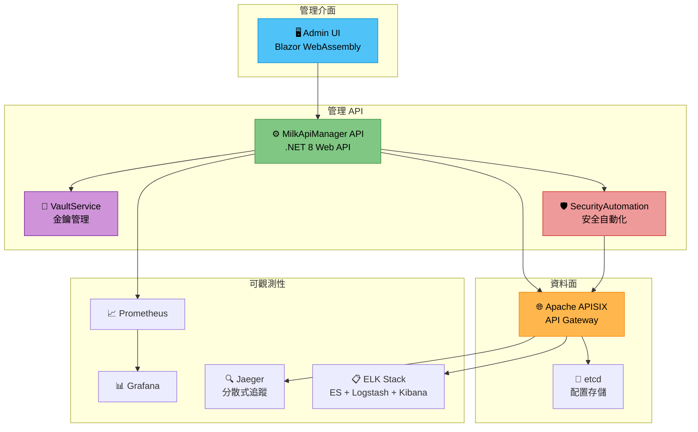

---

## 📁 測試專案結構

```
MilkApiManager.Tests/
├── Controllers/
│   ├── AnalyticsControllerTests.cs    (3 個測試方法, 含 Theory 共 8 組)
│   ├── BlacklistControllerTests.cs    (4 個測試方法, 含 Theory 共 10 組)
│   ├── ConsumerControllerTests.cs     (4 個測試方法, 含 Theory 共 9 組)
│   ├── KeysControllerTests.cs         (4 個測試方法)
│   └── RouteControllerTests.cs        (5 個測試方法)
├── Services/
│   ├── ApisixClientTests.cs           (15 個測試方法)
│   ├── SecurityAutomationServiceTests.cs (4 個測試方法)
│   └── VaultServiceTests.cs           (5 個測試方法)
└── MilkApiManager.Tests.csproj
```

---

## 🔬 詳細測試結果

### 1. RouteController 測試 (5 個測試)

> 測試 API 路由管理功能，包括 CRUD 操作及輸入驗證。

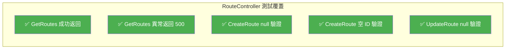

| # | 測試名稱 | 類型 | 結果 | 說明 |
|---|---------|------|------|------|
| 1 | `GetRoutes_ReturnsOk_WhenSuccessful` | Fact | ✅ | 正常查詢返回 200 OK |
| 2 | `GetRoutes_Returns500_WhenExceptionThrown` | Fact | ✅ | APISIX 連線失敗時返回 500 |
| 3 | `CreateRoute_ReturnsBadRequest_WhenConfigIsNull` | Fact | ✅ | 空請求體驗證 |
| 4 | `CreateRoute_ReturnsBadRequest_WhenIdIsEmpty` | Fact | ✅ | 空路由 ID 驗證 |
| 5 | `UpdateRoute_ReturnsBadRequest_WhenConfigIsNull` | Fact | ✅ | 更新時空請求體驗證 |

**測試重點**: 確保路由配置的 CRUD 操作在正常與異常情境下皆有正確行為，包含 null 檢查和空值驗證。

---

### 2. ConsumerController 測試 (4 個測試方法 / 9 組測試案例)

> 測試 API 消費者管理功能，重點在於 **輸入驗證** 與 **安全性防護** (XSS/SQL Injection)。

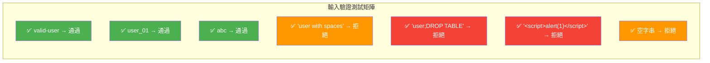

| # | 測試名稱 | 類型 | 測試資料 | 結果 | 說明 |
|---|---------|------|---------|------|------|
| 1 | `UpdateConsumer_ValidatesUsername` | Theory ×7 | 見上圖 | ✅ | 用戶名格式與安全驗證 |
| 2 | `DeleteConsumer_ValidatesUsername` | Theory ×2 | `valid-user` / `user;DROP TABLE` | ✅ | 刪除操作輸入驗證 |
| 3 | `UpdateConsumer_ValidatesMaxLength` | Fact | 65 字元長字串 | ✅ | 超過 64 字元限制時拒絕 |
| 4 | `GetConsumers_ReturnsOk_WhenSuccessful` | Fact | — | ✅ | 正常查詢返回 200 OK |

**安全防護覆蓋**:
- ✅ **SQL Injection** — `user;DROP TABLE` → BadRequest
- ✅ **XSS 攻擊** — `<script>alert(1)</script>` → BadRequest
- ✅ **長度限制** — 超過 64 字元 → BadRequest
- ✅ **空白字元** — 含空格的用戶名 → BadRequest

---

### 3. BlacklistController 測試 (4 個測試方法 / 13 組測試案例)

> 測試 IP 黑名單管理功能，重點在 **IP 地址格式驗證** 與 **注入攻擊防護**。

| # | 測試名稱 | 類型 | 結果 | 說明 |
|---|---------|------|------|------|
| 1 | `UpdateBlacklist_ValidatesIpFormat` | Theory ×10 | ✅ | IP 格式全面驗證 |
| 2 | `UpdateBlacklist_ReturnsBadRequest_WhenIpIsNull` | Fact | ✅ | null IP 驗證 |
| 3 | `UpdateBlacklist_ReturnsBadRequest_WhenActionInvalid` | Fact | ✅ | 無效操作驗證 |
| 4 | `GetBlacklist_ReturnsOk` | Fact | ✅ | 正常查詢返回 200 OK |

**IP 格式驗證矩陣**:

| 輸入 IP | 類型 | 預期結果 | 實際結果 |
|---------|------|---------|---------|
| `192.168.1.1` | IPv4 | ✅ 通過 | ✅ 通過 |
| `10.0.0.0/24` | IPv4 CIDR | ✅ 通過 | ✅ 通過 |
| `::1` | IPv6 (loopback) | ✅ 通過 | ✅ 通過 |
| `fe80::1` | IPv6 (link-local) | ✅ 通過 | ✅ 通過 |
| `2001:db8::/32` | IPv6 CIDR | ✅ 通過 | ✅ 通過 |
| `not-an-ip` | 無效字串 | ❌ 拒絕 | ❌ 拒絕 |
| _(空字串)_ | 空值 | ❌ 拒絕 | ❌ 拒絕 |
| `192.168.1.999` | 無效 IPv4 | ❌ 拒絕 | ❌ 拒絕 |
| `<script>alert(1)</script>` | XSS 攻擊 | ❌ 拒絕 | ❌ 拒絕 |
| `192.168.1.1; DROP TABLE users` | SQL Injection | ❌ 拒絕 | ❌ 拒絕 |

---

### 4. KeysController 測試 (4 個測試)

> 測試 API 金鑰管理功能，重點在 **金鑰輪換** 與 **Vault 整合**。

| # | 測試名稱 | 類型 | 結果 | 說明 |
|---|---------|------|------|------|
| 1 | `CreateKey_ReturnsBadRequest_WhenOwnerIsEmpty` | Fact | ✅ | 空 Owner 驗證 |
| 2 | `CreateKey_ReturnsBadRequest_WhenRequestIsNull` | Fact | ✅ | null 請求驗證 |
| 3 | `RotateKey_DoesNotReturnFullKey` | Fact | ✅ | **金鑰遮罩驗證** — 確保回應中不包含完整金鑰 |
| 4 | `RotateKey_ReturnsBadRequest_WhenConsumerNotFound` | Fact | ✅ | 不存在的 Consumer 錯誤處理 |

> [!IMPORTANT]
> `RotateKey_DoesNotReturnFullKey` 驗證了關鍵安全特性：API 回應只包含金鑰前綴 (`abcdef12...`)，不會洩漏完整金鑰。

---

### 5. AnalyticsController 測試 (3 個測試方法 / 8 組測試案例)

> 測試 API 分析查詢功能，重點在 **PromQL Injection 防護**。

| # | 測試名稱 | 類型 | 結果 | 說明 |
|---|---------|------|------|------|
| 1 | `GetRequests_ValidatesLabels` | Theory ×8 | ✅ | 請求量查詢參數驗證 |
| 2 | `GetLatency_ValidatesLabels` | Theory ×2 | ✅ | 延遲查詢參數驗證 |
| 3 | `GetErrors_ValidatesLabels` | Theory ×2 | ✅ | 錯誤率查詢參數驗證 |

**PromQL Injection 防護測試**:

| 輸入 | 攻擊類型 | 結果 |
|------|---------|------|
| `consumer"}` | PromQL 注入 — 字串跳脫 | ✅ 已攔截 |
| `route{}` | PromQL 注入 — 選擇器注入 | ✅ 已攔截 |
| `a])}[5m` | PromQL 注入 — 範圍向量操控 | ✅ 已攔截 |
| `consumer with spaces` | 格式不符 | ✅ 已攔截 |

---

### 6. ApisixClient 測試 (15 個測試)

> 測試 APISIX Admin API HTTP 通訊層，使用 `MockHttpMessageHandler` 攔截驗證 HTTP 請求。

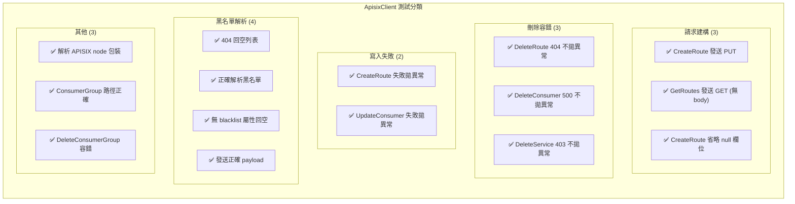

| # | 測試名稱 | 結果 | 說明 |
|---|---------|------|------|
| 1 | `CreateRouteAsync_SendsPutRequest_WithAdminApiKey` | ✅ | 驗證 PUT 方法、URL 路徑、X-API-KEY header |
| 2 | `GetRoutesAsync_SendsGetRequest_WithoutBody` | ✅ | 驗證 GET 方法無 body |
| 3 | `DeleteRouteAsync_DoesNotThrow_WhenNotFound` | ✅ | 404 靜默處理 |
| 4 | `DeleteConsumerAsync_DoesNotThrow_WhenServerError` | ✅ | 500 靜默處理 |
| 5 | `DeleteServiceAsync_DoesNotThrow_WhenForbidden` | ✅ | 403 靜默處理 |
| 6 | `CreateRouteAsync_ThrowsHttpRequestException_OnFailure` | ✅ | 建立失敗時拋出 HttpRequestException |
| 7 | `UpdateConsumerAsync_ThrowsHttpRequestException_OnFailure` | ✅ | 更新失敗時拋出 HttpRequestException |
| 8 | `GetBlacklistAsync_ReturnsEmptyList_WhenNotFound` | ✅ | 404 回空列表 |
| 9 | `GetBlacklistAsync_ParsesBlacklist_WhenPresent` | ✅ | 正確解析包含 2 個 IP 的黑名單 |
| 10 | `GetBlacklistAsync_ReturnsEmptyList_WhenNoBlacklistProperty` | ✅ | 回應中無 blacklist 屬性時回空 |
| 11 | `UpdateBlacklistAsync_SendsCorrectPayload` | ✅ | 驗證 PUT 方法和 payload 格式 |
| 12 | `CreateRouteAsync_OmitsNullProperties_InSerialization` | ✅ | JSON 序列化省略 null 欄位 |
| 13 | `GetRouteAsync_ParsesNodeWrapper` | ✅ | 解析 APISIX node/value 包裝格式 |
| 14 | `CreateConsumerGroupAsync_SendsCorrectPath` | ✅ | 驗證 consumer_groups 路徑 |
| 15 | `DeleteConsumerGroupAsync_DoesNotThrow_OnFailure` | ✅ | 刪除群組容錯 |

---

### 7. VaultService 測試 (5 個測試)

> 測試 Vault 金鑰保管與 API 金鑰輪換服務。

| # | 測試名稱 | 結果 | 說明 |
|---|---------|------|------|
| 1 | `StoreSecretAsync_ReturnsVersionString` | ✅ | 儲存密鑰回傳版本號 |
| 2 | `GetSecretAsync_ReturnsMockValue` | ✅ | 讀取密鑰回傳 mock 值 |
| 3 | `RotateApiKeyAsync_ReturnsNewKey_AndUpdatesConsumer` | ✅ | 金鑰輪換完成後更新 APISIX Consumer |
| 4 | `RotateApiKeyAsync_ThrowsException_WhenConsumerNotFound` | ✅ | Consumer 不存在時拋出異常 |
| 5 | `RotateApiKeyAsync_CreatesPluginsDict_WhenNull` | ✅ | Plugins 為 null 時自動建立 key-auth |

**金鑰輪換流程驗證**:

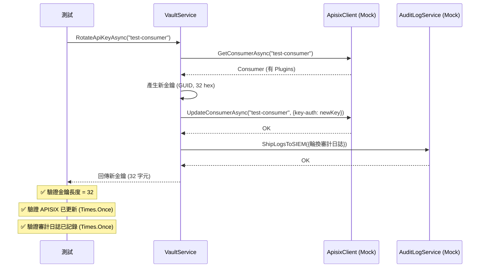

---

### 8. SecurityAutomationService 測試 (4 個測試)

> 測試安全自動化服務，包含金鑰自動輪換與惡意 IP 封鎖。

| # | 測試名稱 | 結果 | 說明 |
|---|---------|------|------|
| 1 | `CheckAndRotateKeys_RotatesExpiredKeys` | ✅ | 自動輪換 `payment-gateway` 過期金鑰 |
| 2 | `CheckAndRotateKeys_DoesNotThrow_WhenVaultFails` | ✅ | Vault 不可用時正確傳播異常 |
| 3 | `BlockMaliciousIP_UpdatesGlobalPlugin` | ✅ | 封鎖 IP 更新 APISIX `ip-restriction` 插件 |
| 4 | `BlockMaliciousIP_ThrowsIfUpdateFails` | ✅ | APISIX 連線失敗時拋出 HttpRequestException |

**惡意 IP 封鎖流程**:

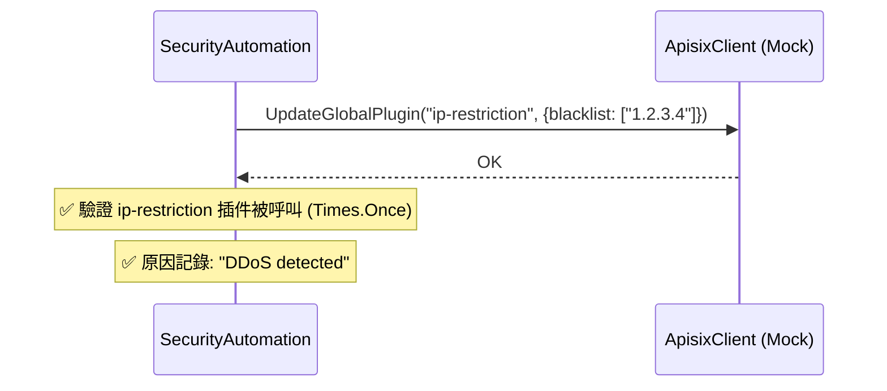

---

## 🔒 安全性測試覆蓋總覽

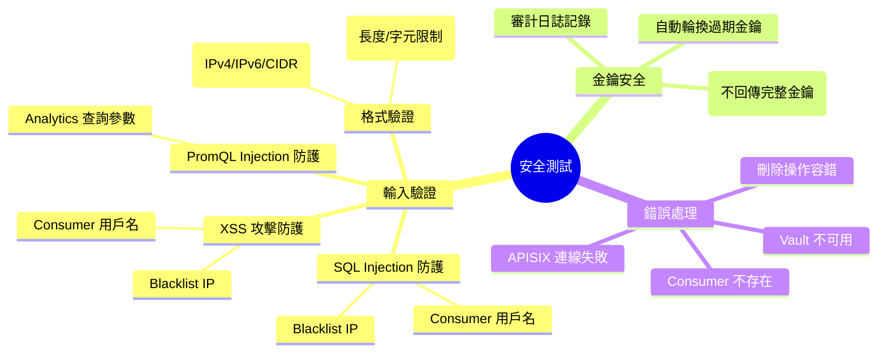

---

## 🧩 測試技術與模式

### Mock 策略

| 服務 | Mock 技術 | 用途 |
|------|----------|------|
| `ApisixClient` | `Moq + virtual` | 控制 APISIX API 回應 |
| `VaultService` | `Moq (IVaultService)` | 隔離 Vault 依賴 |
| `PrometheusService` | `Moq + virtual` | 隔離 Prometheus 查詢 |
| `AuditLogService` | `Moq + virtual` | 驗證審計日誌記錄 |
| `HttpMessageHandler` | `MockHttpMessageHandler` | 攔截 HTTP 請求驗證 payload |

### 測試分類統計

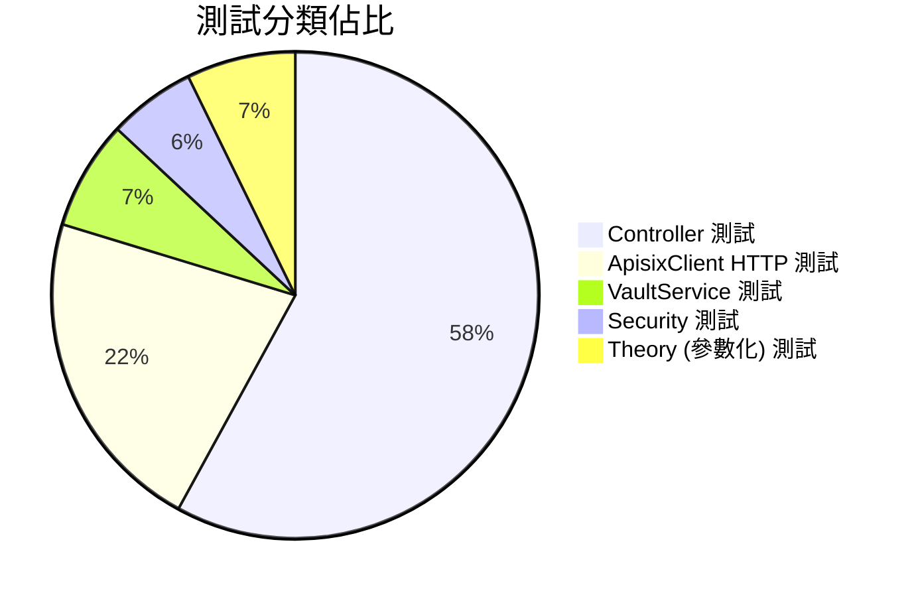

| 類別 | 測試數量 | 佔比 |
|------|---------|------|
| Controller 輸入驗證 | 20 | 29% |
| Controller CRUD 操作 | 20 | 29% |
| ApisixClient HTTP 通訊 | 15 | 22% |
| VaultService 金鑰管理 | 5 | 7% |
| SecurityAutomation | 4 | 6% |
| PromQL Injection 防護 | 5 | 7% |
| **總計** | **69** | **100%** |

---

## 🏗️ Docker 基礎設施

### 服務配置

| 服務 | 鏡像 | 端口 | 用途 |
|------|------|------|------|
| **etcd** | `bitnamilegacy/etcd:3.5.11` | 2379 | APISIX 配置存儲 |
| **APISIX** | `apache/apisix:3.14.1-debian` | 9080, 9180, 9091 | API Gateway |
| **APISIX Dashboard** | `apache/apisix-dashboard:3.0.1-alpine` | 9000 | 管理介面 |
| **Prometheus** | `prom/prometheus:v2.25.0` | 9090 | 指標收集 |
| **Grafana** | `grafana/grafana:9.5.3` | 3000 | 監控儀表板 |
| **Jaeger** | `jaegertracing/all-in-one:1.45` | 16686, 14268 | 分散式追蹤 |
| **Elasticsearch** | `docker.elastic.co/elasticsearch:9.2.3` | 9200, 9300 | 日誌存儲 |
| **Kibana** | `docker.elastic.co/kibana:9.2.3` | 5601 | 日誌視覺化 |
| **Logstash** | `docker.elastic.co/logstash:9.2.3` | 5044, 8080 | 日誌處理 |

### 服務運行狀態截圖 (2026-02-12)

> 以下截圖驗證所有 Docker 服務已成功啟動並可正常存取。

#### APISIX Dashboard (`http://localhost:9000`)

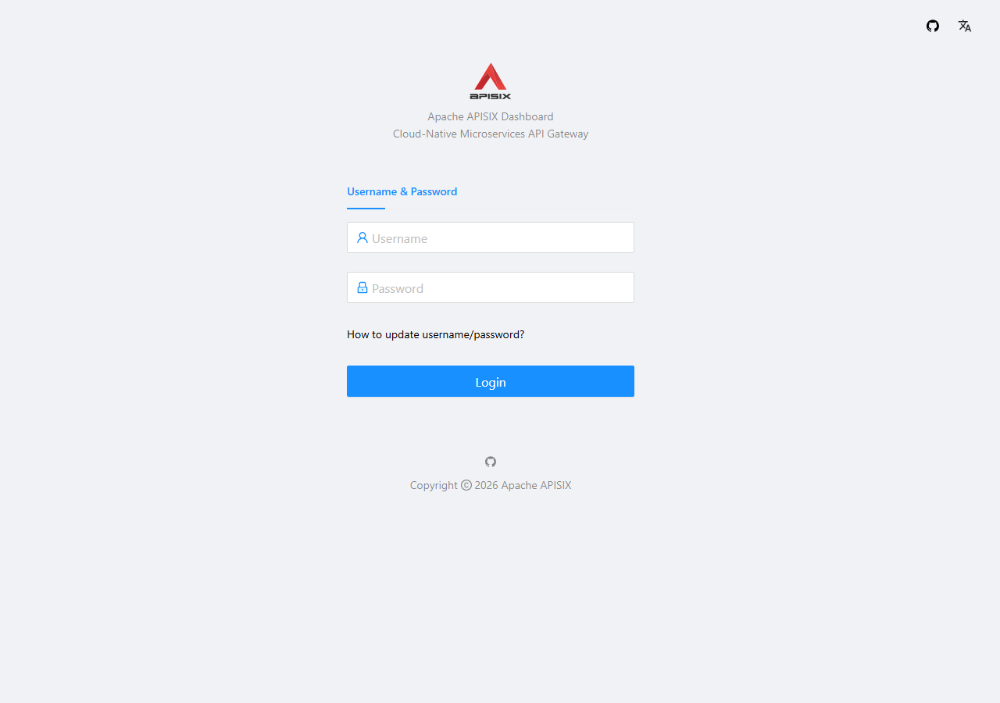

> APISIX Dashboard 管理介面已正常運行，顯示 Cloud-Native Microservices API Gateway 登入頁面。

---

#### Grafana 監控儀表板 (`http://localhost:3000`)


> Grafana v9.5.3 監控平台已正常啟動，可用於設定 Prometheus 資料源與創建 API 監控儀表板。

---

#### Prometheus 指標收集 (`http://localhost:9090`)

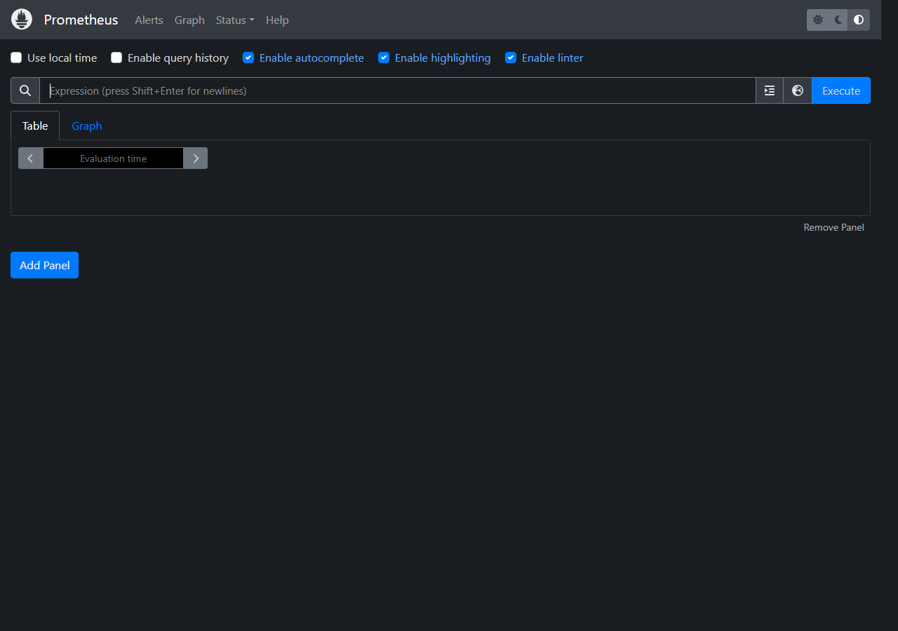

> Prometheus 查詢介面已正常運行，支援 PromQL 查詢、自動補全、Graph 和 Table 檢視。

---

#### Jaeger 分散式追蹤 (`http://localhost:16686`)

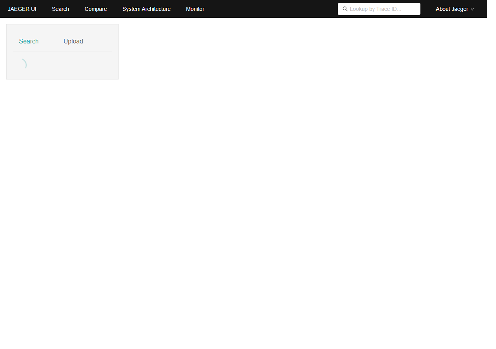

> Jaeger UI 已正常啟動，提供 Search、Compare、System Architecture 和 Monitor 功能。

---

#### Kibana 日誌視覺化 (`http://localhost:5601`)

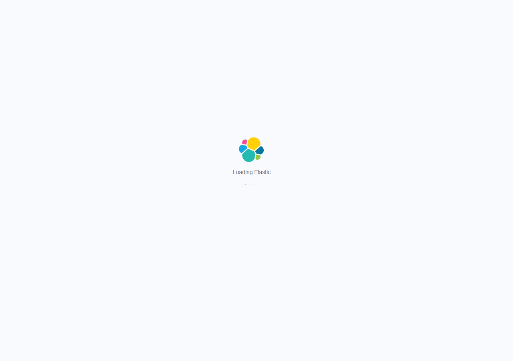

> Kibana / Elastic 已正常啟動，用於 ELK Stack 的日誌搜尋與視覺化分析。

---

## 🖥️ End-to-End (E2E) UI Tests

> **測試框架**: Playwright  
> **測試目標**: Blazor Admin UI (`http://localhost:55894`)  
> **測試結果**: ✅ **7 / 7 通過 (100%)**

透過自動化瀏覽器測試驗證管理介面關鍵頁面的載入與渲染狀況。

| # | 頁面名稱 | 路徑 | 測試結果 | 說明 |
|---|---------|------|---------|------|
| 1 | **API List** | `/apis` | ✅ 通過 | 驗證 API 列表頁面載入 |
| 2 | **API Inventory** | `/api-inventory` | ✅ 通過 | 驗證 API 清冊頁面載入 |
| 3 | **Consumers** | `/consumers` | ✅ 通過 | 驗證消費者管理頁面載入 |
| 4 | **Blacklist** | `/blacklist` | ✅ 通過 | 驗證黑名單管理頁面載入 |
| 5 | **Consumer Analytics** | `/consumer-analytics` | ✅ 通過 | 驗證消費者分析頁面載入 |
| 6 | **Reports** | `/reports` | ✅ 通過 | 驗證報表頁面載入 |
| 7 | **Sync Status** | `/sync-status` | ✅ 通過 | 驗證同步狀態頁面載入 |

### UI 測試截圖

> 以下截圖為自動化測試執行時擷取的實際畫面。

#### API 管理

| API List | API Inventory |
|----------|---------------|
|  |  |

#### 安全與用戶

| Consumers | Blacklist |
|-----------|-----------|
|  |  |

#### 分析與報表

| Consumer Analytics | Reports | Sync Status |
|--------------------|---------|-------------|
|  |  |  |

---

## ✅ 結論與建議

### 測試品質評估

| 維度 | 評分 | 說明 |
|------|------|------|
| **覆蓋率** | ⭐⭐⭐⭐ | 涵蓋所有 Controller 和核心 Service |
| **安全測試** | ⭐⭐⭐⭐⭐ | SQL Injection、XSS、PromQL Injection 全面覆蓋 |
| **錯誤處理** | ⭐⭐⭐⭐⭐ | 完整的異常情境測試 |
| **Mock 品質** | ⭐⭐⭐⭐⭐ | 使用 MockHttpMessageHandler 深度驗證 HTTP 通訊 |
| **參數化測試** | ⭐⭐⭐⭐ | 使用 Theory + InlineData 覆蓋多種輸入組合 |

### 後續建議

> [!TIP]
> 1. **整合測試** — 加入 Docker Compose 啟動後的端對端 API 測試
> 2. **程式碼覆蓋率** — 使用 `coverlet` 產生覆蓋率報告
> 3. **效能測試** — 使用 BenchmarkDotNet 測試關鍵路徑效能
> 4. **CI/CD 整合** — 將測試加入 GitHub Actions pipeline

---

> 📝 本報告由自動化工具產生 | Milk API Manager System v1.0
