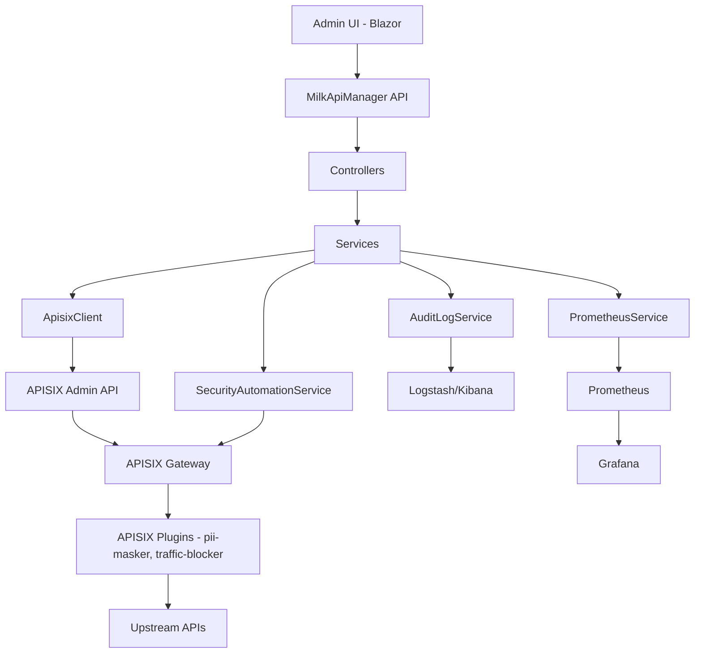

# Architecture Flow (Detailed)

This file mirrors the detailed system flow. For a shorter version, see the README.

```mermaid
flowchart TD
    UI["Admin UI - Blazor"] --> API["MilkApiManager API"]
    API --> Controllers["Controllers"]
    Controllers --> Services["Services"]
    Services --> ApisixClient["ApisixClient"]
    ApisixClient --> AdminAPI["APISIX Admin API"]
    AdminAPI --> Gateway["APISIX Gateway"]
    Gateway --> Plugins["APISIX Plugins - pii-masker, traffic-blocker"]
    Plugins --> Upstream["Upstream APIs"]
    Services --> Security["SecurityAutomationService"]
    Security --> Gateway
    Services --> Audit["AuditLogService"]
    Audit --> ELK["Logstash/Kibana"]
    Services --> Metrics["PrometheusService"]
    Metrics --> Prometheus["Prometheus"]
    Prometheus --> Grafana["Grafana"]
```
