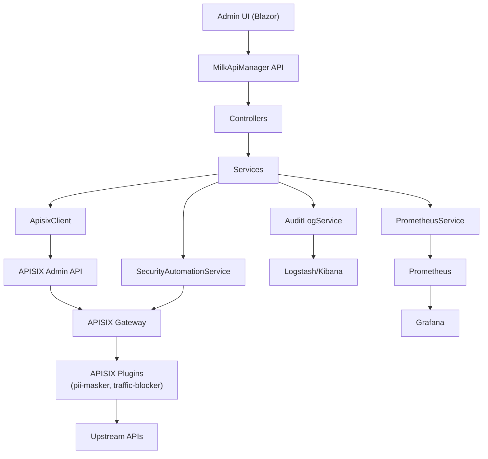

# Architecture Flow (Detailed)

This diagram expands the end-to-end flow across UI, API manager, APISIX, plugins, and observability.

```mermaid
flowchart TD
    UI["Admin UI (Blazor)"] --> API["MilkApiManager API"]

    API --> Controllers["Controllers"]
    Controllers --> Services["Services"]

    Services --> ApisixClient["ApisixClient"]
    ApisixClient --> AdminAPI["APISIX Admin API"]
    AdminAPI --> Gateway["APISIX Gateway"]

    Gateway --> Plugins["APISIX Plugins\n(pii-masker, traffic-blocker)"]
    Plugins --> Upstream["Upstream APIs"]

    Services --> Security["SecurityAutomationService"]
    Security --> Gateway

    Services --> Audit["AuditLogService"]
    Audit --> ELK["Logstash/Kibana"]

    Services --> Metrics["PrometheusService"]
    Metrics --> Prometheus["Prometheus"]
    Prometheus --> Grafana["Grafana"]
```
